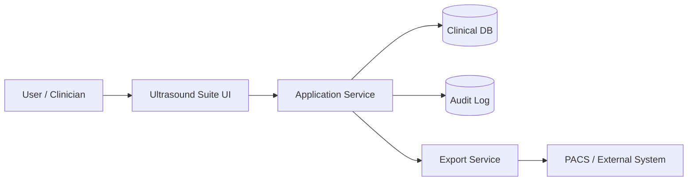
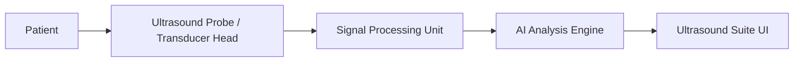

# 3 Requirements & Design

## 🎯 Purpose
Translate clinical and regulatory needs into concrete, testable system requirements and design artefacts. Ensure traceability from stakeholder expectations → requirements (REQ‑IDs) → risks (RSK‑IDs) → validation (TEST‑IDs).

## 🧩 Scope
- Functional requirements (image acquisition, AI analysis, reporting).
- Non‑functional requirements (performance, security, usability).
- Hardware design (ultrasound probe, transducer, signal chain).
- Software architecture (UI, services, DB, audit, PACS integration).
- Regulatory design controls (ISO 13485, IEC 62304, IEC 60601‑1 for electrical safety, IEC 60601‑2‑37 for ultrasound equipment).

---

## 🔄 Process
1. **Capture requirements** from clinicians, QA/RA, IT, and regulators.
2. **Classify**: functional vs non‑functional; regulatory vs business.
3. **Design architecture**: hardware + software + interfaces.
4. **Traceability**: REQ ↔ RSK ↔ TEST.
5. **Review & approve**: design review under ISO 13485 design controls.

## Design overview

### 🖥️ Software Architecture Flow

#### Explanation:

- Clinician interacts with UI.
- Application Service handles business logic.
- Clinical DB stores patient data.
- Audit Log ensures Part 11/GDPR compliance.
- Export Service integrates with PACS/EHR.

### 🩻 Hardware & Transducer Flow

#### Explanation:
- Probe generates acoustic signals and receives echoes.
- Signal Processing Unit converts raw echoes into digital images (IEC 60601‑2‑37 compliance).
- AI Analysis Engine applies ML models (IEC 62304 software lifecycle).
- Results are displayed in the UI for clinician review.

## 🧠 Professional language
“System requirements are decomposed into hardware and software design elements, ensuring compliance with IEC 60601‑1/‑2‑37 for ultrasound equipment and IEC 62304 for software. Bidirectional traceability is maintained between stakeholder needs, risk controls, and verification activities.”

## 💬 Translation to reality
“We write down what the system must do, split it into hardware and software, and make sure every requirement can be tested and linked back to a risk or a rule.”

## 📁 Outputs
- Requirements specification (REQ‑IDs).
- Design description (hardware + software).
- Traceability matrix (REQ ↔ RSK ↔ TEST).
- Architecture diagrams (as above).
- Design review minutes (ISO 13485 evidence).

**Artifacts/Links**  
- Requirements list (product repo): `medibridge-ultrasound-suite/docs/requirements.md`  
- OpenAPI contract: `medibridge-ultrasound-suite/api/openapi.yaml`

> **Related repositories:**  
> • Product & validation: medibridge-ultrasound-suite  
> • Governance & feedback: medibridge-collaboration-hub  
> • Templates & examples: risk-assessment-templates
