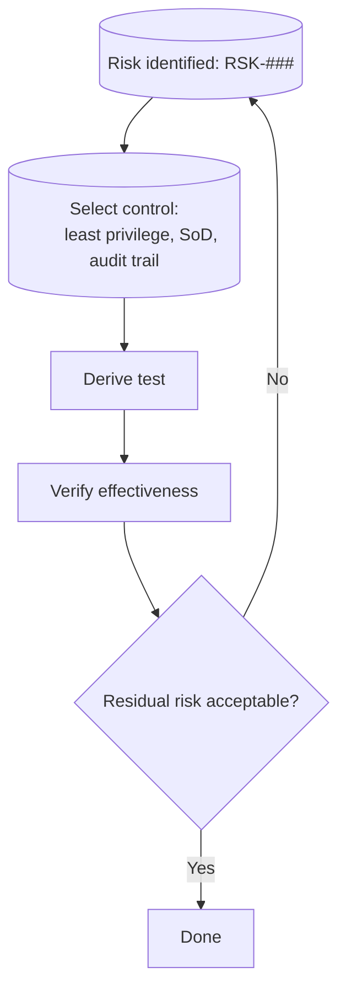
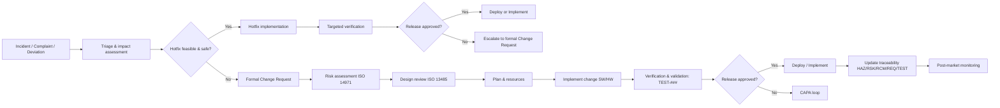

# 4 Risk & QMS

## 🎯 Purpose
Establish a risk-based lifecycle under a documented QMS so the AI-assisted ultrasound system is safe, compliant, and auditable from design to decommissioning. Align risk management per ISO 14971 with quality processes per ISO 13485, and map controls to verification and ongoing monitoring in EU and US regulatory contexts.

## 🧩 Scope
Risk framework: ISO 14971 hazard identification, risk analysis, control, verification, residual risk evaluation, and periodic review.

QMS integration: ISO 13485 design controls, document control, training, change control, CAPA, internal audits, management review.

Regulatory anchors: EU MDR Annex I (GSPR), FDA 21 CFR Part 820 (Design Controls, CAPA), 21 CFR Part 11 (e-records/e-signatures), GAMP 5 (computerized systems).

Technical domains: Hardware safety (IEC 60601-1/-2-37), software lifecycle (IEC 62304), usability (IEC 62366-1), cybersecurity/privacy (least privilege, SoD, audit trails, encryption, DPIA under GDPR; HIPAA where applicable).

## 🔄 Process
1. Plan the risk process: Define Risk Management Plan (criteria, scales, roles, reviews) and its linkage to the QMS and design controls.
2. Identify hazards and causes: Clinical, hardware, software/AI, usability, cybersecurity/privacy, supplier/ops; create HAZ-IDs with clear scenarios and root causes.
3. Analyze and evaluate risks: Assign severity/probability; apply acceptability criteria; prioritize high-risk items for early control.
4. Select and implement controls: Inherent safety by design, protective measures (technical/organizational), and information for safety; derive REQ-IDs and RCM-IDs.
5. Verify effectiveness: Define TEST-IDs; execute verification/validation; collect objective evidence; raise deviations and CAPA where needed.
6. Decide residual risk and monitor: Document benefit–risk rationale; define PMS metrics, monitoring thresholds, review cadence.

### Risk control lifecycle flow
A compact loop that turns each identified risk into a control, a test, and a decision on residual risk, with iteration when results are not acceptable. 
Below chart demonstrates the Risk control lifecycle for MediBridge AI-assisted ultrasound:


#### Explanation:
- Identify: Capture the risk as an RSK-### with linked hazard and context.
- Control: Choose proportionate measures (design, technical, procedural) and record as RCM-###.
- Test: Define TEST-### that proves the control is effective and robust.
- Verify: Run tests, log evidence, assess deviations and impacts.
- Decide: If residual risk is unacceptable, iterate; if acceptable, document rationale and monitoring plan.

### Incident-to-control and change pathway
Below diagram shows the Risk-driven CAPA and change control


#### Explanation:
- **Triage**: Assess severity, likelihood, and operational impact to choose the safe path.
- **Hotfix path**: Time-critical changes with targeted verification and a release gate.
- Formal change path: Full risk assessment, design review, implementation, and V&V before release.
- Traceability and PMS: Update links after deployment; monitor effectiveness and recurrence.
---

## 🧠 Professional language
Risk management is executed per ISO 14971 and governed within an ISO 13485 QMS, ensuring bidirectional traceability from hazards (HAZ-###) to risk assessments (RSK-###), controls (RCM-###), and verification/validation evidence (TEST-###). CAPA and change control integrate incident signals into risk assessment and validated releases, with residual risks justified against clinical benefit and monitored via PMS.

## 💬 Translation to reality
We design how the system reacts when something goes wrong: assess the impact, choose a safe path, fix it, prove it works, and only then release. We keep records updated and watch performance so the same issue doesn’t happen again.

## 📁 Outputs
- Risk management plan (RMP): Process, criteria, roles, review cadence.
- Hazard and risk file: HAZ-###, RSK-### with severity/probability and rationale.
- Risk controls (RCM-###): Design/protective/information measures linked to requirements.
- Traceability matrix: HAZ ↔ RSK ↔ RCM/REQ ↔ TEST with clause references.
- Verification/validation evidence: VPL (plan), VP (protocols), TR (reports), deviations, CAPA.
- Residual risk and benefit–risk report: Acceptability decisions and monitoring actions.
- Operational monitoring set: PMS metrics, incident/change records, audit findings, training and competency logs.

## 🧠 Professional language
> “Risk management is performed in accordance with ISO 14971, integrated into the ISO 13485 QMS, ensuring traceability from identified hazards through implemented controls to verification evidence. Residual risks are evaluated against clinical benefits, with continuous monitoring via PMS and CAPA.”

## 💬 Translation to reality
> “We make a list of everything that could go wrong – from probe overheating to AI giving a wrong answer. We rate how bad and how likely it is, decide how to prevent it, and test that our fixes actually work. If something still goes wrong in real life, we log it, learn from it, and improve.”

---

## 📁 Outputs
- **Risk Management Plan (RMP)** – defines process, criteria, responsibilities.
- **Hazard Analysis (HAZ‑IDs)** – list of hazards, causes, effects.
- **Risk Control Measures (RCM‑IDs)** – linked to requirements and tests.
- **Traceability Matrix** – Hazard ↔ Requirement ↔ Test.
- **Risk Management Report (RMR)** – summary of residual risks and benefit‑risk.
- **CAPA Records** – deviations, corrective actions, preventive actions.


## Risk-driven controls (Mermaid)

```mermaid
--8<-- "snippets/change-triage.mmd"
```

**Artifacts/Links**  
- Templates & examples: `risk-assessment-templates`  
- Worked example (Ultrasound Suite ITRA): `risk-assessment-templates/examples/ultrasound-suite-itra.md`

> **Related repositories:**  
> • Product & validation: medibridge-ultrasound-suite  
> • Governance & feedback: medibridge-collaboration-hub  
> • Templates & examples: risk-assessment-templates
