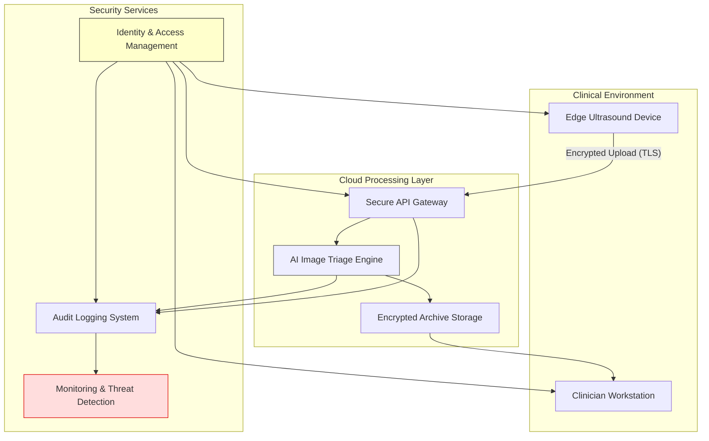

# 06 – Information Security and Identity & Access Management (IAM)

This section outlines the cybersecurity strategy, access control architecture, and regulatory obligations related to IT security for the Medibridge AI Suite. It includes risk assessments, technical controls, and compliance with NIS2, ISO/IEC standards, and MDR cybersecurity clauses.

---

## 🎯 Goals

- Define cybersecurity risk governance framework
- Identify threats to data integrity, availability, and confidentiality
- Demonstrate NIS2, ISO/IEC 27001, and MDR compliance
- Document technical and procedural security controls
- Support secure design, validation, and post-market monitoring

---

## 🧩 Subsections

| Document | Description |
|----------|-------------|
| [NIS2 Cybersecurity Impact Review](nis2-risk-review.md) | Cybersecurity threats, controls, and governance |
| [IAM Controls and Role Matrix](iam-role-matrix.md) *(optional)* | Role-based access model aligned to ISO 27001 |
| [Cybersecurity Policy Overview](cyber-policy.md) *(optional)* | Draft security and access control policy |
| [Audit & Logging Requirements](audit-logging.md) *(optional)* | Guidelines for traceability and monitoring |

---

## 🔐 Security Standards

- **ISO/IEC 27001** – Information Security Management
- **ISO/IEC 81001-5-1** – Cybersecurity for Health Software
- **ISO/IEC 27005** – Information Security Risk Management
- **ISO/IEC 27701** – Privacy Management aligned with GDPR
- **NIS2 Directive** – Network and Information Security (EU)

---

## ⚠️ Cybersecurity in EU MDR

- **Annex I, Section 17.2** requires devices to:
  - Prevent unauthorized access
  - Ensure data confidentiality and integrity
  - Maintain secure communication and updates

---

## 🧠 Access Governance

- Access defined using **RBAC** (Role-Based Access Control)
- Least privilege model for internal and external stakeholders
- Admin roles segregated from operational users

---

## 🔐 Cybersecurity Architecture Overview

### 🧠 Diagram Highlights

- **Ultrasound Device**:
  - Uploads image data over secure TLS
  - Authenticated via IAM

- **API Gateway**:
  - Enforces encryption, rate limiting, and authentication

- **AI Triage Engine**:
  - Processes and classifies image data
  - Outputs either archived (no-findings) or flagged (suspicious) data

- **IAM**:
  - Central access control for all users/devices/services
  - Role-based with MFA where applicable

- **Audit Logs + SIEM**:
  - Every transaction is logged
  - Logs feed into threat detection system for anomaly analysis
---
_Last updated: October 2025_

## 📁 Data Classification Schema

This classification aligns with ISO/IEC 27001 and supports appropriate protection measures under NIS2, GDPR, and MDR Annex I (17.2).

| Data Type | Description | Classification | Protection Measures |
|-----------|-------------|-----------------|---------------------|
| Patient Imaging Data | Ultrasound scans | **Highly Sensitive** | Encrypted in transit (TLS 1.3), encrypted at rest (AES-256) |
| Triage Output | AI classification metadata (e.g., "no findings", "suspicious") | **Sensitive** | Access control via IAM, audit logging |
| User Credentials | Clinician/admin login info | **Confidential** | Password hashing, MFA, secure vault |
| Access Logs | User and system access events | **Internal Only** | Immutable logs, retention policy |
| Configuration Files | AI engine parameters, DICOM settings | **Internal** | Version-controlled, access-limited |
| System Health Metrics | CPU, RAM, job logs | **Internal (Operational)** | Monitoring only, no PHI |

## 🔐 Role-Based Access Control (RBAC) Matrix

This access control model enforces least privilege principles and traceability across all system roles.

| Role | Description | System Access | Data Access | Security Restrictions |
|------|-------------|---------------|-------------|------------------------|
| **Clinician** | Reviews flagged images | Web Interface | Patient Imaging, Triage Results | View-only; cannot export raw data |
| **Radiologist Reviewer** | Final decision-maker | Web Portal + Annotator Tool | Full Image + Report | Requires MFA |
| **System Admin** | Manages system config | All infrastructure layers | Logs, config files | No access to imaging data |
| **AI Engineer** | Maintains model + updates | AI Engine, Config, Logs | Anonymized Triage Data | No access to patient info |
| **IT Support** | Device and network support | Hardware + Gateway | Logs only | Read-only; no data transfer rights |
| **Security Auditor** | Reviews access, anomalies | SIEM + Audit Logs | Logs, Access Events | Restricted by time-limited token |
| **Data Protection Officer (DPO)** | GDPR oversight | Logs + Access Policies | User roles, breach reports | No direct system control |

---

## ✅ Notes

- All users authenticated via **IAM** platform (OIDC + MFA)
- Elevated roles require **just-in-time (JIT)** provisioning
- All access logged and reviewed periodically
- Access reviewed quarterly or after role changes

> **Related repositories:**  
> • Product & validation: medibridge-ultrasound-suite  
> • Governance & feedback: medibridge-collaboration-hub  
> • Templates & examples: risk-assessment-templates

