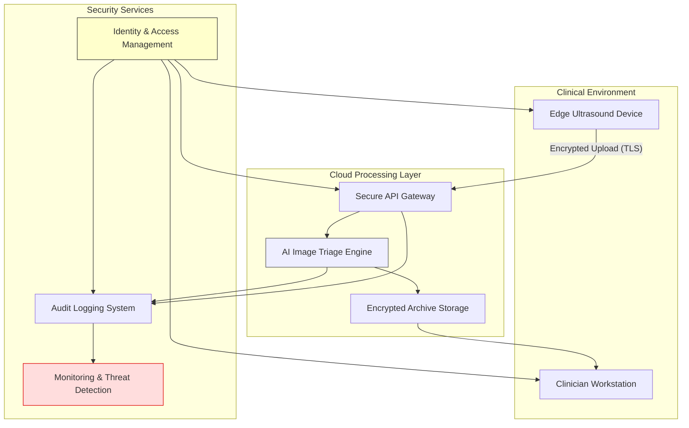

# 06 – Information Security and Identity & Access Management (IAM)

This section defines the information security governance framework for the MediBridge Ultrasound AI Suite. It supports compliance with **EU MDR**, **NIS2**, **GDPR**, **HIPAA**, and **ISO/IEC 27001**, and covers cybersecurity architecture, access control, threat detection, and risk management.

---

## 🔐 Key Objectives

- Ensure secure data handling across all lifecycle stages  
- Define risk-based access controls (RBAC)  
- Align with EU NIS2 Directive and MDR Annex I (17.2)  
- Implement traceable IAM, audit logs, and secure configuration  
- Integrate health software cybersecurity (ISO/IEC 81001-5-1)  

---

## 📁 Contents

| Document | Description |
|----------|-------------|
| [NIS2 Risk Review](nis2-risk-review.md) | Cybersecurity threats, risk analysis, and mitigations |
| [IAM Role Matrix](iam-role-matrix.md) | Role-based access control by user type |
| [Audit Logging Guidelines](audit-logging.md) | Monitoring and traceability controls |
| [Cybersecurity Policy Overview](cyber-policy.md) | Draft policy aligning with ISO/IEC 27001 and NIS2 |
| [GAMP 5 Alignment](gamp5-alignment.md) | Validation and lifecycle alignment for regulated environments |

---

## 🧩 Cybersecurity Architecture

# 🗂 Data Classification & Protection Schema

This document defines the data sensitivity levels and associated protection controls for the MediBridge Ultrasound AI Suite. It supports compliance with **NIS2**, **ISO/IEC 27001**, **GDPR**, and **EU MDR Annex I, Section 17.2**.

---

# 🗂 Data Classification & Protection Schema

This document defines how MediBridge classifies, protects, and governs all data processed by the Ultrasound AI Suite.  
It ensures compliance with **GDPR**, **HIPAA**, **ISO/IEC 27001**, **ISO/IEC 27701**, **ISO/IEC 81001‑5‑1**, **EU MDR Annex I (17.2)**, and the **NIS2 Directive (EU) 2022/2555**.  

---

## 📁 Data Classification Table

| Data Type | Description | Classification | Protection Measures |
|-----------|-------------|----------------|---------------------|
| **Patient Identification Data (PII/PHI)** | Personal identifiers such as name, date of birth, address, national/social security number, or patient ID | **Highly Sensitive** | Stored/transmitted only when necessary; encrypted at rest (AES‑256) and in transit (TLS 1.3); pseudonymization and strict access control; GDPR Art. 32 compliance |
| **Clinical / Diagnostic Data** | Ultrasound findings, diagnostic notes, referral reason, or prior history imported from EMR | **Highly Sensitive** | Encrypted at rest and in transit; access restricted to authorized clinicians; full audit logging and retention per hospital policy |
| **Patient Imaging Data** | Ultrasound images (DICOM format) potentially containing patient metadata | **Highly Sensitive** | DICOM header anonymization for AI model use; encryption at rest (AES‑256); TLS 1.3; IAM enforcement and audit trail |
| **AI Triage Output** | AI‑generated classification metadata (e.g. “normal” / “suspicious”) | **Sensitive** | IAM‑controlled access; audit logging; no patient identifiers stored |
| **User Credentials** | Clinician/admin login information | **Confidential** | Password hashing (Argon2/Bcrypt), MFA, vault‑secured credentials |
| **Access Logs** | User and system access events | **Internal Only** | Immutable log storage; time‑synchronized; retention per policy |
| **Configuration Files** | AI engine parameters, DICOM settings, workflow configs | **Internal** | Version‑controlled; restricted access |
| **System Metrics / Telemetry** | Resource utilization, performance, uptime | **Operational (Non‑PHI)** | Monitoring‑only; aggregated and non‑identifiable |

---

### 🧾 Notes

- All personal and health data (PII/PHI) are handled under **Data Processing Agreements (DPAs)** with healthcare institutions.  
- **Data minimization**, **pseudonymization**, and **role‑based access** are applied throughout processing.  
- Data retention and deletion follow hospital policy and GDPR Art. 5(1)(e).  

---

# 🔐 IAM Role Matrix (RBAC)

[View full RBAC matrix here →](iam-role-matrix.md)

| Role | Access Scope | Restrictions |
|------|--------------|--------------|
| **Clinician** | Review flagged images | View‑only |
| **Radiologist** | Full annotated review | MFA required |
| **Admin** | System configuration only | No access to patient or imaging data |
| **AI Engineer** | AI model tuning and configuration | Anonymized data only |
| **IT Support** | Infrastructure maintenance and logs | Read‑only; no PHI access |
| **Auditor** | Access, anomaly, and compliance review | Token‑based, time‑limited access |
| **Data Protection Officer (DPO)** | GDPR oversight and audit | No system control; policy‑level access only |

---

# 🏛 Standards Referenced

- **ISO/IEC 27001:2022** – Information Security Management  
- **ISO/IEC 81001‑5‑1:2021** – Cybersecurity for Health Software  
- **ISO/IEC 27005:2022** – Information Security Risk Management  
- **ISO/IEC 27701:2019** – Privacy Information Management (GDPR‑aligned)  
- **ISO/IEC 27018:2019** – Protection of PII in Public Clouds  
- **EU NIS2 Directive (2022/2555)**  
- **EU MDR Annex I, Section 17.2** – Protection Against Unauthorized Access  

---

**Maintained by:** Security Officer / QA‑RA Lead  
**Last Updated:** October 2025
