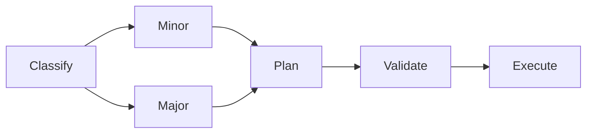
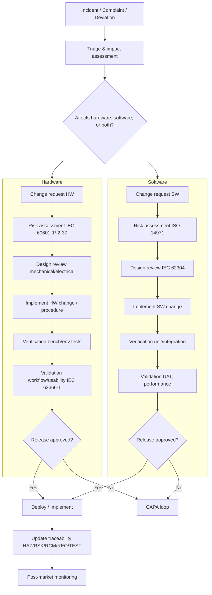

# 9 Change Control

**Purpose**  
Ensure changes are assessed, approved, implemented, and verified effectively.

**Scope**  
- Impact analysis, risk re-check, approvals  
- Effectiveness check and documentation

**Process (short)**  
1) Log change with context and linked REQ/RSK  
2) Assess impact, define validation touchpoints  
3) Implement, verify, and record effectiveness

## Change triage (Mermaid)

Below chart show the Incident-to-control with hardware and software branches

#### Explanation:
- Hardware branch: Electrical/acoustic safety and environmental verification, plus usability validation.
- Software branch: IEC 62304 design controls with formal verification and UAT.
- Unified release gate: Both branches converge on deployment, traceability updates, and PMS tracking.
---

**Artifacts/Links**  
- Collaboration decisions (ADRs): `medibridge-collaboration-hub/docs/decision-log.md`  
- Validation touchpoints: `medibridge-ultrasound-suite/validation/`

## Showcase thread #1 — One-click Save (feedback → release)
**Story in one line:** Clinicians want a **one-click** way to save and export results.

- **Feedback** → `medibridge-collaboration-hub/feedback-log/2025-01-15-save-case-one-click.md`
- **User story** → `medibridge-collaboration-hub/user-stories/US-001-export-results.md`
- **Requirement** → `medibridge-ultrasound-suite/docs/requirements.md` (REQ-001)
- **Risk/ITRA** → `risk-assessment-templates/examples/ultrasound-suite-itra.md` (RSK-005)
- **Validation** → `medibridge-ultrasound-suite/validation/test-plans/VPL-001-system-test-plan.md`
- **Traceability** → `medibridge-ultrasound-suite/validation/traceability-matrix.md`
- **Release note** → (placeholder)

> This thread shows how a clinical request becomes a validated feature with traceability and risk rationale.

> **Related repositories:**  
> • Product & validation: medibridge-ultrasound-suite  
> • Governance & feedback: medibridge-collaboration-hub  
> • Templates & examples: risk-assessment-templates
