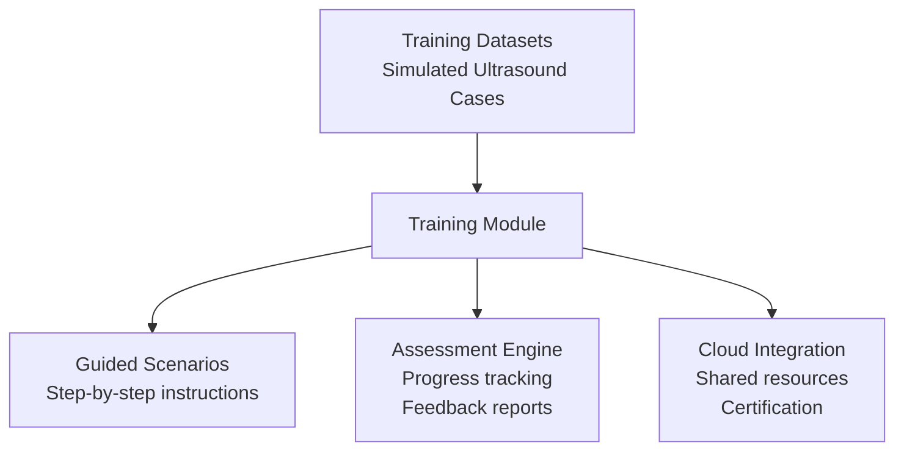
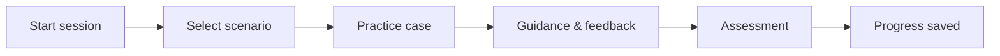

[⬅️ Back to MediBridge Hub](https://github.com/BridgingKnowledge/Medibridge-Ultrasound-Suite)

# 🎓 MediBridge Training

The **MediBridge Training Module** is part of the MediBridge ecosystem.  
It provides clinicians, application specialists, and developers with a **safe, guided environment** to learn, practice, and master ultrasound workflows.

## 🎯 Purpose
- Offer hands-on training without risk to patients  
- Provide simulation datasets for realistic practice  
- Support onboarding of new staff with guided scenarios  
- Enable continuous learning and certification  

## 🌍 Key Features
- **Simulation Mode**: Replay real-world ultrasound cases with anonymized data  
- **Guided Scenarios**: Step-by-step training for specific procedures  
- **Assessment Tools**: Track progress, measure accuracy, and provide feedback  
- **Integration**: Connects seamlessly with the MediBridge Cloud for shared learning resources  

## 👩‍⚕️ Target Users
- **Clinicians**: Practicing procedures and improving diagnostic accuracy  
- **Application Specialists**: Delivering structured training sessions  
- **Developers**: Extending training content and integrating new modules  

## 🔗 Relation to MediBridge
This module is part of the larger MediBridge Suite.  
For an overview of the full system, see [About MediBridge](https://github.com/BridgingKnowledge/Medibridge-Ultrasound-Suite).

## 🏥 Training Architecture

## 🔄 Typical Training Flow

## 🔗 Role-specific training

This module can be adapted to different user groups. To see the case “Male with suspicious areas” explained for each role:

- **Clinicians:** [Training clinicians](https://github.com/BridgingKnowledge/medibridge-training-clinicians)
- **Specialists:** [Training specialists](https://github.com/BridgingKnowledge/medibridge-training-specialists)
- **Developers:** [Training developers](https://github.com/BridgingKnowledge/medibridge-training-developers)

💡 MediBridge Training demonstrates how one case can be translated into different perspectives, showing flexibility in communication and knowledge transfer.

# 12 – Training & Competence

Short introduction to training and competence development.

> **Related repositories:**  
> • Product & validation: medibridge-ultrasound-suite  
> • Governance & feedback: medibridge-collaboration-hub  
> • Templates & examples: risk-assessment-templates
